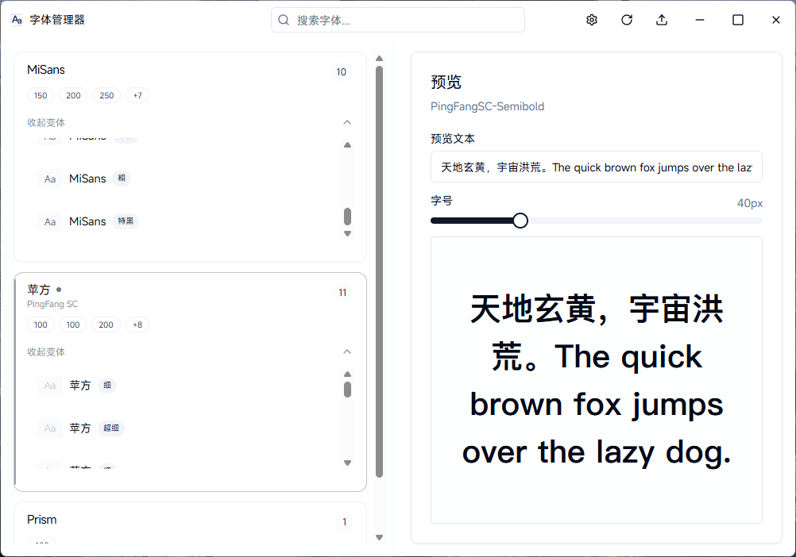

<div align="center">


# Font Manager
### 现代化的跨平台字体管理专家

[](LICENSE)
[](https://tauri.app)
[](https://react.dev)
[](https://www.typescriptlang.org/)
[](https://www.rust-lang.org/)

<p align="center">
  <a href="#-功能特性">功能特性</a> •
  <a href="#-应用截图">应用截图</a> •
  <a href="#-安装指南">安装指南</a> •
  <a href="#-技术栈">技术栈</a> •
  <a href="#-参与贡献">参与贡献</a>
</p>

</div>

---

**Font Manager** 是一款基于 **Tauri**、**React** 和 **Rust** 构建的下一代字体管理工具。它旨在提供极致的性能体验，让字体管理变得简单、直观且高效。无论您是设计师、开发者还是字体爱好者，它都是您管理字体库的得力助手。

## ✨ 功能特性

<table>
  <tr>
    <td width="50%">
      <h3>🚀 极速轻量</h3>
      <p>由 Rust 后端驱动，启动速度极快，内存占用极低。即使面对上万款字体的庞大库，依然能保持丝滑流畅。</p>
    </td>
    <td width="50%">
      <h3>🖥️ 跨平台支持</h3>
      <p>一次编写，处处运行。完美支持 Windows、macOS 和 Linux 系统，提供一致的用户体验。</p>
    </td>
  </tr>
  <tr>
    <td width="50%">
      <h3>👁️ 实时预览</h3>
      <p>支持字体家族及变体的实时渲染预览。您可以自定义预览文本、字号，所见即所得。</p>
    </td>
    <td width="50%">
      <h3>⚡ 一键管理</h3>
      <p>告别繁琐的系统设置。支持拖拽安装、一键卸载，让字体管理像管理文件一样简单。</p>
    </td>
  </tr>
  <tr>
    <td width="50%">
      <h3>🔍 智能筛选</h3>
      <p>强大的搜索与筛选功能。支持按名称模糊搜索，并可一键隐藏系统内置字体，专注于您安装的创意字体。</p>
    </td>
    <td width="50%">
      <h3>🌙 深色模式</h3>
      <p>内置精心设计的深色与浅色主题，自动适应系统设置，呵护您的双眼。</p>
    </td>
  </tr>
</table>

## 📸 应用截图

<div align="center">
  
  <p><i>主界面：简洁直观的字体列表与实时预览面板</i></p>
</div>

## 🚀 安装指南

### 📦 下载安装包

我们为各个平台提供了预构建的安装包。请前往 [Releases](https://github.com/yourusername/font-manager/releases) 页面下载最新版本。

### 🛠️ 源码构建

如果您希望从源码构建或参与开发，请按照以下步骤操作：

#### 前置要求

*   **Node.js**: v16 或更高版本
*   **Rust**: 最新的 stable 版本
*   **构建工具**:
    *   Windows: [VS C++ Build Tools](https://visualstudio.microsoft.com/visual-cpp-build-tools/)
    *   Linux: `libwebkit2gtk-4.0-dev`, `build-essential`, `curl`, `wget`, `libssl-dev`, `libgtk-3-dev`, `libayatana-appindicator3-dev`, `librsvg2-dev`
    *   macOS: Xcode Command Line Tools

#### 构建步骤

1.  **克隆仓库**
    ```bash
    git clone https://github.com/yourusername/font-manager.git
    cd font-manager
    ```

2.  **安装依赖**
    ```bash
    npm install
    ```

3.  **开发模式运行**
    ```bash
    npm run tauri dev
    ```

4.  **打包构建**
    ```bash
    npm run tauri build
    ```

## 🛠️ 技术栈

本项目采用了当前最前沿的 Web 与原生开发技术栈：

*   **UI 框架**: [React](https://react.dev/) + [TypeScript](https://www.typescriptlang.org/)
*   **样式库**: [Tailwind CSS](https://tailwindcss.com/) + [Shadcn UI](https://ui.shadcn.com/)
*   **应用框架**: [Tauri](https://tauri.app/) (Rust)
*   **状态管理**: React Hooks (useState, useMemo, useCallback)
*   **性能优化**:
    *   `react-virtuoso`: 实现高性能虚拟列表
    *   `FontFace API`: 消除字体加载闪烁 (FOUT)
    *   `Web Workers`: 后台处理繁重任务

## 📄 开源协议

本项目采用 **GNU Affero General Public License v3.0 (AGPLv3)** 协议开源。这意味着您可以自由地使用、修改和分发本软件，但如果您通过网络提供服务，则必须公开源代码。详情请参阅 [LICENSE](LICENSE) 文件。

## 🤝 参与贡献

我们非常欢迎社区的贡献！无论是修复 Bug、添加新功能，还是改进文档，您的帮助都至关重要。

1.  Fork 本项目
2.  创建您的特性分支 (`git checkout -b feature/AmazingFeature`)
3.  提交您的修改 (`git commit -m 'Add some AmazingFeature'`)
4.  推送到分支 (`git push origin feature/AmazingFeature`)
5.  提交 Pull Request

